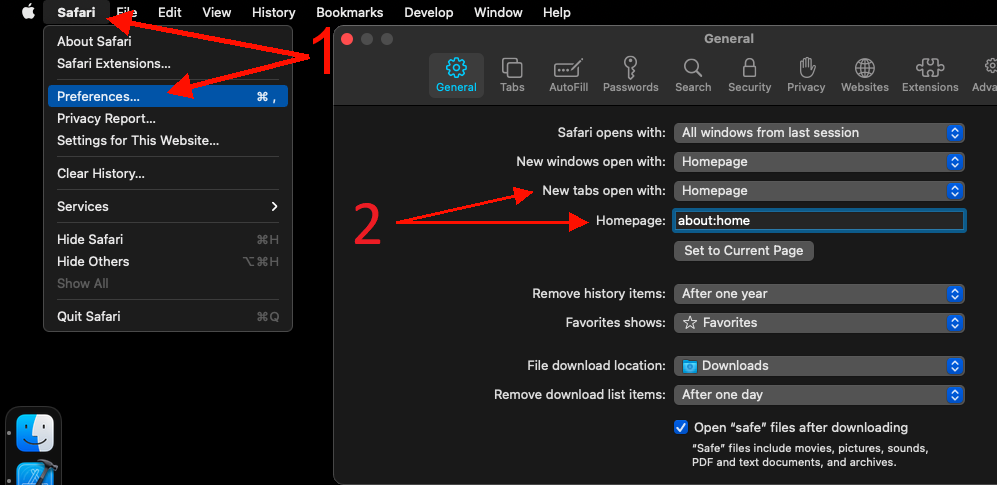

# Safari Setup

__Group Speed Dial Pro__ needs access to all hosts (domains) in order to create thumbnails and download fav-icons.  
If you don't grant access to all domains, some features will not work correctly.

### How to allow for all domains:
1. click the toolbar icon
1. select "Always Allow on Every Website..."
1. confirm "Always Allow on Every Website"

### How to override New Tab page:
1. click "Safari" in the menu bar and choose "Preferences..."
1. on the tab "General" change the "New tabs open with" to "Empty Page"  
   (to override Homepage, set it to "about:blank")
1. open Options page in Group Speed Dial and enable "Replace Safari Empty Page with your Dials page"

   

### How to open Dials page with your keyboard:
There are two shortcuts available:
- use "Ctrl + T" to open dials page in the New tab
- use "Ctrl + H" to open dials page in the current tab
